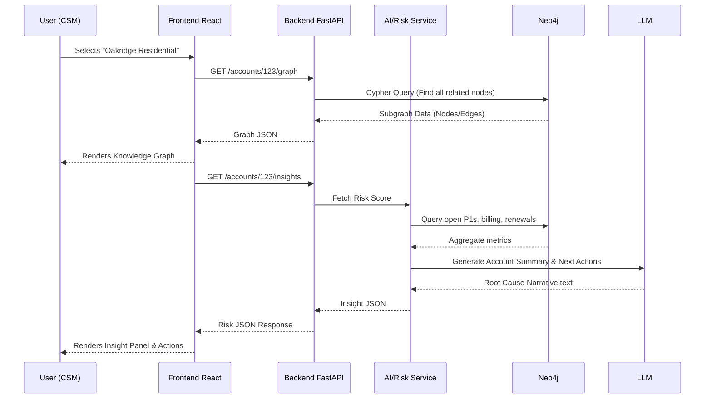

# API Reference

The Python backend exposes the following RESTful endpoints to feed the Knowledge Graph UI.

## Endpoints

1. `GET /accounts/search?q=`
   - Returns matching PMCs or Accounts.
2. `GET /accounts/{account_id}`
   - Returns the high-level account summary.
3. `GET /accounts/{account_id}/graph`
   - Returns nodes and edges required for rendering the D3/Vis.js interactive graph.
4. `GET /accounts/{account_id}/insights`
   - Returns the calculated risk score, risk factors, AI summary, and generated recommendations.
5. `POST /ingest/sample-data`
   - Bulk loads sample datasets into Neo4j.
6. `POST /links/manual`
   - Allows user-added relationship/context (CSM Human overlay).

## Application Flow

