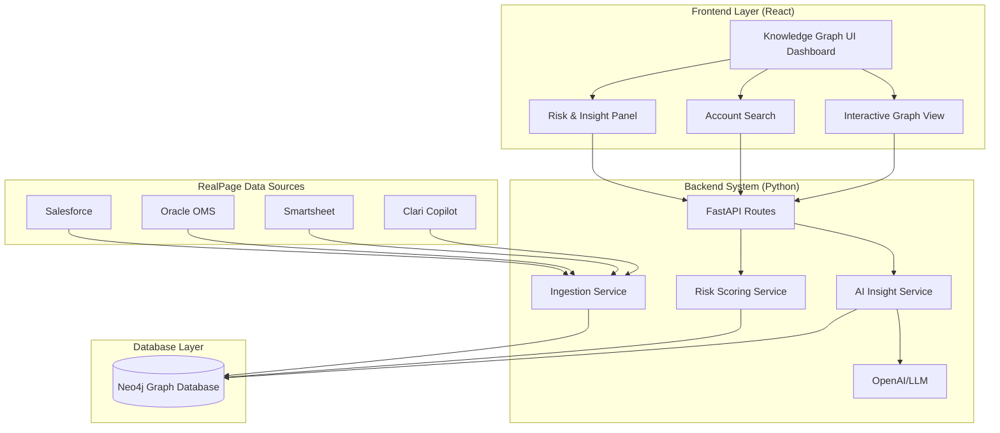

# System Architecture

The Customer Interaction Knowledge Graph project follows a standard modern web stack decoupled from a graph database intelligence layer.

## Component Architecture

Below is the high-level component diagram illustrating how our custom application sits above the RealPage data ecosystem.



## Folder Structure

```text
/HACKATHON
├── frontend/ (React UI)
│   └── src/
│       ├── components/    # GraphView, NodeDetails, InsightPanel
│       ├── pages/         # Search page, Account details
│       ├── services/      # API communication
│       └── types/         # Typescript interfaces
└── backend/  (Python App)
    └── app/
        ├── routes/        # /accounts, /ingest, /insights 
        ├── services/      # neo4j_service, risk_service
        ├── models/        # Pydantic schemas
        └── data/          # Synthetic CSVs
```
