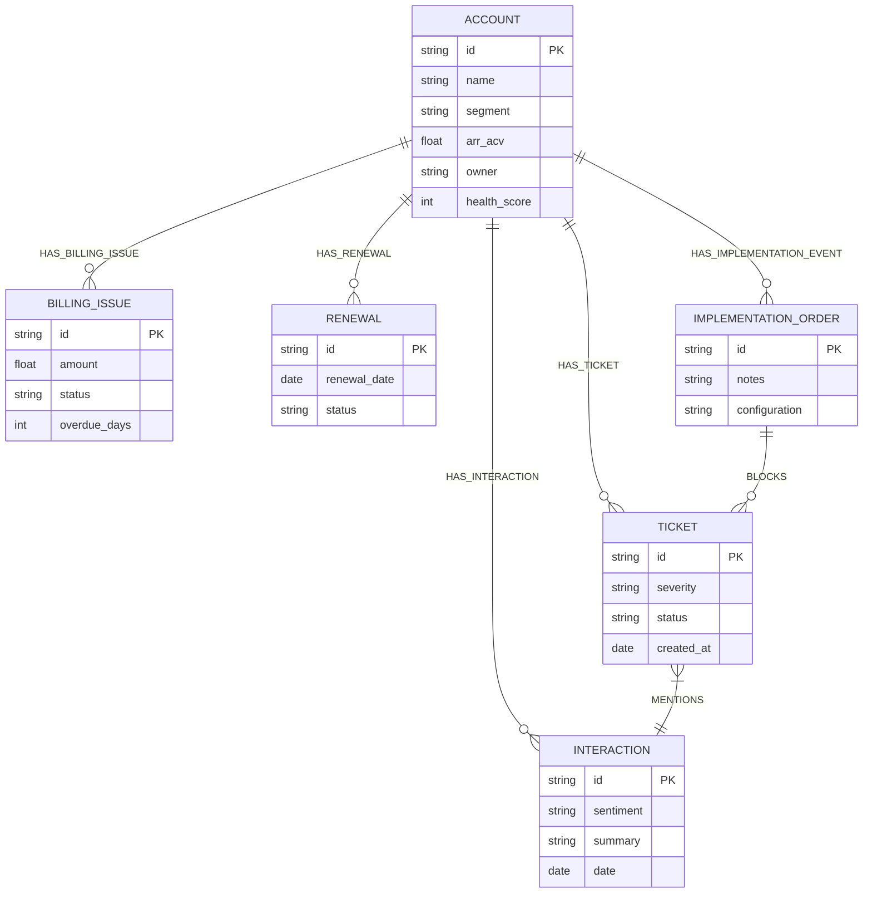

# Database Schema

The intelligence layer is powered by **Neo4j** to uncover relationships that traditional relational databases obscure.

## Graph Entity-Relationship Diagram

## Node Labels
- **Account**, **Property**, **Product**
- **Ticket** (Support/PME)
- **BillingIssue** (Collections/Aging)
- **Interaction** (Clari/Salesforce calls)
- **Renewal** (Opportunities)
- **ImplementationOrder** (OMS Open Orders)
- **Escalation** 

## Tracking Customizations
Crucially, the `ImplementationOrder` nodes store *notes*, tracking customizations and key configuration decisions outside of best practice, assisting support to better troubleshoot specific PMC setups.
