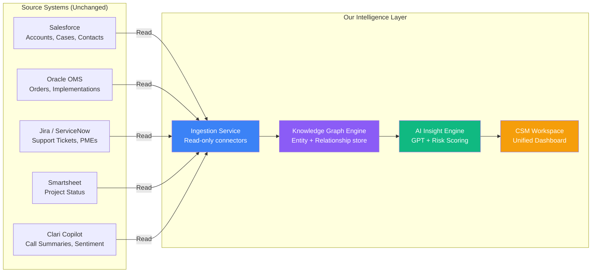

# Product Positioning & Strategic Vision

> **Document Type:** Strategic Alignment  
> **Audience:** Hackathon Team, Judges, Executive Stakeholders  
> **Version:** 1.0 — April 2026

---

## The Answer in One Sentence

> **We are NOT replacing Salesforce. We are building the intelligence layer that makes every system RealPage already uses — Salesforce, OMS, Jira, Smartsheet — dramatically more valuable by connecting what they keep separate.**

This distinction is not just semantics. It is the difference between a pitch that **lands** and one that gets immediately dismissed by judges who know the business.

---

## Part 1 — The Problem With Trying to Replace Salesforce

### Why "Replace Salesforce" Is the Wrong Bet

Salesforce is not just a tool at RealPage — it is infrastructure. RealPage has:

- **Years of historical customer data** stored in Salesforce
- **Entire team workflows** (Sales, CS, Support, Renewals) built on top of it
- **Existing license contracts** worth millions of dollars
- **Integrations** connecting Salesforce to OneSite, OMS, billing, and more

Proposing to replace Salesforce in a hackathon pitch signals one of two things to judges:

1. You don't understand enterprise software reality
2. Your solution requires a multi-year, multi-million dollar migration — which no internal sponsor will champion

**Either interpretation eliminates you from winning.**

The smarter, more credible, and ultimately more impactful position is something entirely different.

---

## Part 2 — The Correct Positioning: Intelligence Layer, Not Replacement

### What Salesforce Is Good At (And We Are Not Competing With)

Salesforce is a world-class **record-keeping and workflow system**. It excels at:

- Storing structured records (accounts, contacts, opportunities, cases)
- Managing pipeline stages and sales workflows
- Logging interactions and maintaining audit trails
- Generating reports from structured relational data

**We don't touch any of this. We don't want to.**

### What Salesforce Cannot Do (And We Specifically Solve)

This is where the differentiation lives. Salesforce stores **rows of data**. Our system understands **the relationships between those rows** — and surfaces intelligence from those relationships.

| Capability | Salesforce | Our System |
|---|---|---|
| Store ticket records | ✅ Excellent | Not applicable |
| Store contract records | ✅ Excellent | Not applicable |
| Show a CSM the *connection* between a P1 ticket, a billing dispute, AND an upcoming renewal — simultaneously | ❌ Requires 3+ screens + manual correlation | ✅ Single unified graph view |
| Understand that 2 open tickets on the same product family signal a systemic risk, not isolated incidents | ❌ Each ticket is an independent record | ✅ Graph traversal detects clusters |
| Generate an AI narrative explaining WHY an account is at risk, grounded in actual interconnected data | ❌ Einstein AI operates on flat record fields | ✅ LLM reasoning on graph-structured context |
| Surface risk proactively to the CSM before they open an account | ❌ Requires manual report-building | ✅ Proactive alert engine |
| Let a CSM add a qualitative overlay ("Leadership change at customer") into the AI's risk calculation | ❌ No native AI context injection | ✅ Human Context Overlay (our unique feature) |
| Unify signals from Salesforce + OMS + Jira + Smartsheet + Clari into a single entity view | ❌ Salesforce only sees its own data | ✅ Cross-system graph aggregation |

---

## Part 3 — The Architecture Metaphor That Will Win the Room

Use this metaphor in your pitch:

> **"Salesforce is the filing cabinet. Our system is the detective's evidence board."**
>
> A filing cabinet is essential — every document is organized, labeled, and retrievable. But a filing cabinet cannot tell you that the Post-it Note in drawer 3 is connected to the invoice in drawer 7 and the call log in drawer 12 — and that together, they predict a $200,000 churn event in 28 days. That's what a detective's evidence board does. That's what we built.

This framing:

- **Respects Salesforce** (doesn't threaten existing relationships)
- **Positions us as additive**, not disruptive
- **Explains graph thinking** without requiring judges to know what a knowledge graph is
- **Centers the value** on insight, not technology

---

## Part 4 — Integration Depth: What We Connect and How

### Tier 1: Read-Only Integration (Hackathon Scope)

We consume data from existing systems. We do not write back to them, modify records, or require any API permissions beyond read access.



This is the correct scope for the hackathon. It is:

- **Technically feasible** — read-only integrations are approved in hours, not months
- **Organizationally safe** — no risk of corrupting source data
- **Strategically sound** — all value creation happens in our layer, not in their systems

### Tier 2: Bi-Directional Integration (Post-Hackathon Roadmap)

After winning, the system can evolve to write intelligence back to source systems:

- Push risk scores as a custom field into Salesforce Account records
- Create Salesforce Tasks automatically from our "Recommended Actions" output
- Trigger Jira escalation tickets when our AI detects critical risk
- Update Smartsheet implementation status based on graph-detected patterns

**But do not pitch this as your current scope.** Pitch it as the roadmap.

---

## Part 5 — The Three Unique Innovations We Bring

These are the specific capabilities that **no existing RealPage tool, including Salesforce, currently provides**:

### Innovation 1: Graph-Topology Risk Intelligence

**What it is:** We model customer relationships as a property graph, not flat records. Every entity (ticket, billing issue, renewal, contact, product) is a node. Every relationship between entities is an edge. Risk is computed across the graph — not just within a row.

**Why it matters:** A single P2 ticket is noise. A P2 ticket connected to a billing dispute connected to a product with declining adoption connected to a renewal in 22 days is a churn event. Only a graph can see this pattern.

**What Salesforce does instead:** Each of those four signals exists as a separate record in a separate object. A CSM must manually navigate Accounts → Cases → Opportunities → Invoices to piece together the picture. Most never do.

---

### Innovation 2: LLM Reasoning Grounded in Graph Context (RAG)

**What it is:** When a CSM opens an account, we pass the complete graph node context (all connected entities and their properties) to GPT-3.5 as structured input. The model generates a natural-language risk narrative grounded in the actual account data — not generic templates.

**Why it matters:** The output reads like a senior CSM who has deeply reviewed the account:

> *"Oakridge Residential Group presents a high probability of churn in the near term. The combination of three unresolved P1 tickets in the leasing module, a $4,200 billing dispute open for 47 days, and a renewal call not yet scheduled with 28 days remaining suggests systemic dissatisfaction rather than isolated incidents. Immediate escalation is recommended."*

**What Salesforce Einstein does instead:** Einstein operates on individual record fields and produces generic suggestions like "Follow up with this contact." It does not cross-correlate signals across objects or generate investigative narratives.

---

### Innovation 3: Human Context Overlay (Our Unique Differentiator)

**What it is:** AI handles structured data signals. But CSMs possess qualitative intelligence that no system captures — *"Their CFO just left," "Their board is considering switching property managers," "We had a difficult QBR last month."* Our system lets a CSM inject these qualitative signals directly into the AI context before generating the insight.

**Why it matters:** This makes the AI **dramatically more accurate** than any purely data-driven model, because it incorporates the human context that structured systems never capture. No competitor offers this pattern — not Salesforce, not ServiceNow, not Gainsight, not Totango.

**Example flow:**
```
CSM types: "FYI - their VP of Operations resigned last week"
                    ↓
Added to graph as a "ContextSignal" node
                    ↓
Passed to GPT alongside structured signals
                    ↓
AI output now incorporates leadership instability
as a risk driver in its narrative
```

---

## Part 6 — How to Say This in the Pitch (Word-for-Word)

When a judge asks *"Isn't this just Salesforce with a graph view on top?"* — here is the precise response:

> *"That's exactly the right question. Salesforce is essential infrastructure and we have zero intention of replacing it. What Salesforce cannot do is connect its own data. A billing dispute in Salesforce is one record. A support ticket is another. A renewal date is a third. They live in separate objects, and a CSM has to manually correlate them. Our system reads all of that data and builds a live relationship graph on top of it — so the connections become visible, machine-understandable, and AI-explainable. We're not a Salesforce competitor. We're what makes Salesforce's data finally actionable."*

---

## Part 7 — Competitive Landscape (Be Ready for This Question)

Judges may ask how this differs from tools like Gainsight, Totango, or ChurnZero (all Customer Success platforms). Here is the answer:

| Tool | What It Does | Our Advantage |
|---|---|---|
| **Gainsight** | Customer health scoring + playbooks | Generic CRM-level data; no graph topology; no cross-system relationship modeling |
| **Totango** | Customer journey tracking + segment scoring | Requires data already in clean CRM format; no graph; no LLM reasoning |
| **ChurnZero** | Churn risk prediction + in-app engagement | SaaS-focused, not built for PMS/property management domain complexity |
| **Salesforce Einstein** | AI on Salesforce records | Operates on individual records, not relationship graphs; no cross-object AI reasoning |
| **Our Solution** | Graph-structured, LLM-reasoned, human-overlaid risk intelligence — built specifically for RealPage's entity model | The only system that models tickets, renewals, billing, implementations, and contacts as a **connected graph** with AI that understands the **relationships**, not just the records |

---

## Part 8 — Final Positioning Statement

This is your north star. Every feature you build, every slide you design, every answer you give to a judge question should reinforce this statement:

> **"The Customer Interaction Knowledge Graph is RealPage's internal AI intelligence layer — a system that reads from every existing tool without disrupting any of them, connects signals that were previously invisible in isolation, and gives every Customer Success Manager a single AI-powered workspace that tells them not just what is happening in their accounts, but why it is happening and exactly what to do next."**

We are:

- ✅ **Complementary** — We enhance every system RealPage already has
- ✅ **Non-disruptive** — Read-only integration, no workflow changes required
- ✅ **Domain-specific** — Built for property management, not generic CRM
- ✅ **Uniquely innovative** — Graph topology + LLM reasoning + human context overlay is a combination no existing product offers

We are **not**:

- ❌ A Salesforce replacement
- ❌ A competing CRM
- ❌ A generic BI dashboard with a pretty graph
- ❌ A solution that requires teams to change how they work

---

*This positioning is derived from the project charter, SME leadership alignment (Lauren Neal, Jennifer Stout, Hilliard Sumner), and alignment with Project Next: Product Reliability and Core Experience.*
