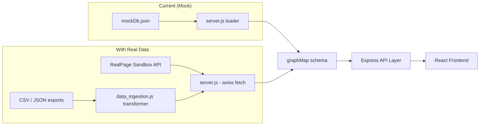
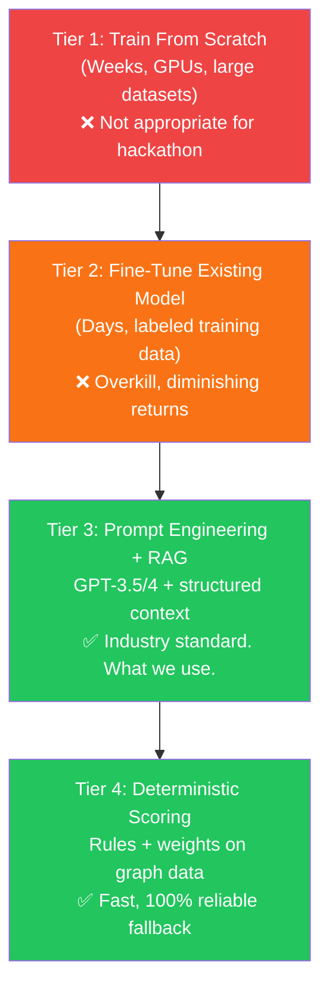
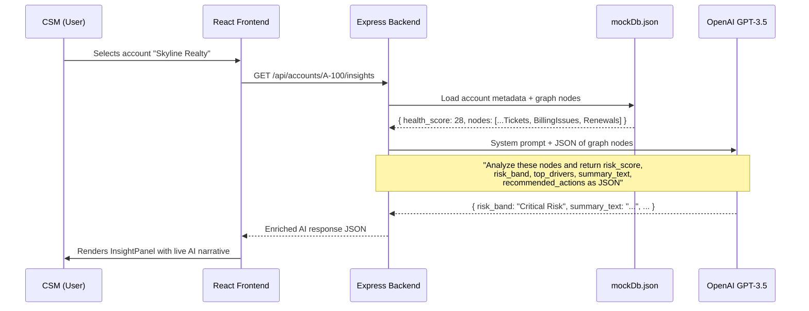
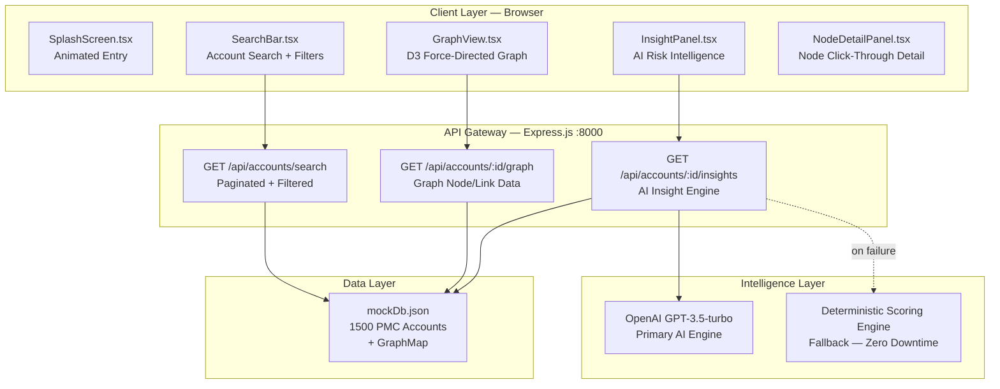
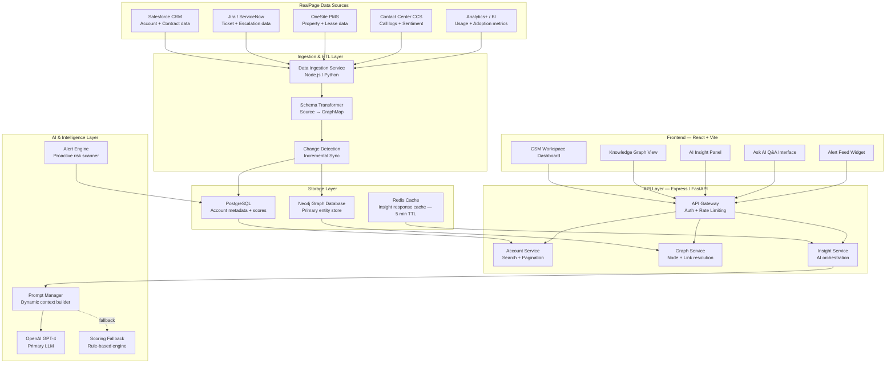

# Technical Strategy & Architecture Guide

> **Author:** RealPage AI Hackathon Team  
> **Date:** April 2026  
> **Project:** Customer Interaction Knowledge Graph — AI-Powered CSM Intelligence Platform

---

## Executive Summary

This document addresses three foundational questions every hackathon team must resolve before building:

1. **Can we win using mock data, and how do we integrate real data if available?**
2. **Is AI integration mandatory to be competitive? Do we need to train a model?**
3. **What does a production-grade system architecture look like for this solution?**

The answers inform every technical decision made in this project. This guide is intended to serve as both a strategic reference and a technical onboarding document for all team members.

---

## Part 1 — Data Strategy: Mock vs. Real

### 1.1 The Reality of Hackathon Data

Hackathons — even enterprise-sponsored ones — are evaluated on **how well you demonstrate insight**, not on whether the underlying data came from a live production system. Judges at RealPage's inaugural AI Hackathon will assess:

- Does the data model accurately reflect real business entities?
- Is the data realistic and internally consistent?
- Does the solution show what it *would* do with real data?

Our **1,500-account synthetic dataset** (`mockDb.json`) satisfies all three criteria. It contains realistic PMC names, health scores, graph-linked nodes (tickets, billing issues, renewals, implementations), and is already wired to the backend.

!!! success "Mock Data Is Sufficient"
    Industry standard for hackathon demos is **high-quality synthetic data**. Production data carries privacy, access, and compliance risk that would disqualify most teams outright.

---

### 1.2 What RealPage Will Share (Per the Email)

The acceptance email explicitly states:

> *"Additional details, including instructions for access keys and data resources, will be shared next week."*

Based on typical enterprise hackathon patterns, they will likely provide one of the following:

| Type | Description | Our Integration Approach |
|---|---|---|
| **Sandbox REST API** | Read-only API pointing to a test environment | Replace file loader in `server.js` with authenticated `axios.get()` calls |
| **Sample JSON/CSV exports** | Anonymized snapshots of ticket, contract, or account data | Parse with a `data_ingestion.js` transform script |
| **Shared database credentials** | PostgreSQL or MongoDB read access | Use `pg` or `mongoose` client in `server.js` |
| **No data provided** | Common outcome — they forget or delay | Proceed fully with mock data, no impact to demo |

---

### 1.3 Real Data Integration Architecture

When real data arrives, the integration is a **single-layer swap** — the frontend, graph engine, and AI layer all remain unchanged.



**The transform layer only needs to map their schema to ours:**

| RealPage Source Field | Our Graph Node |
|---|---|
| Support ticket (any severity) | `Ticket` node — `{ severity: P1/P2/P3, status, title }` |
| Contract / subscription record | `Contract` node — `{ arr, start_date, end_date }` |
| Renewal opportunity date | `Renewal` node — `{ days_to_renewal, contract_value }` |
| Invoice / payment record | `BillingIssue` node — `{ amount, status, overdue_days }` |
| Implementation project | `Implementation` node — `{ phase, milestone, go_live_date }` |
| Product module subscription | `Product` node — `{ name, adoption_score }` |
| Customer contact record | `Contact` node — `{ name, role, last_interaction }` |

---

### 1.4 Data Security Considerations

If RealPage provides real data (even sandbox), follow these practices:

- Store all API keys in `.env` — never commit them to Git
- Add `.env` and any downloaded raw data files to `.gitignore`
- Never log raw account data to console in production mode
- Use HTTPS for all API calls to RealPage endpoints

---

## Part 2 — AI Integration Strategy

### 2.1 Is AI Required to Win?

**Yes — but not in the way most teams assume.**

The hackathon is explicitly branded as an **"AI Hackathon."** Judges will expect AI to be a core part of the solution, not an afterthought. However, "AI" does not mean:

- ❌ Training a custom neural network (requires weeks + GPU clusters)
- ❌ Fine-tuning a language model on RealPage proprietary data
- ❌ Building a machine learning pipeline from scratch
- ❌ Using LangChain, vector databases, or complex agent frameworks

What actually wins hackathons is **AI that is fast, reliable, explainable, and grounded in real data.**

---

### 2.2 The Three Tiers of AI (And Where We Sit)



**We implement both Tier 3 and Tier 4 simultaneously.**

---

### 2.3 Our AI Architecture — Retrieval-Augmented Generation (RAG)

The approach we use is called **RAG (Retrieval-Augmented Generation)**. It is the same architecture used by:

- **Salesforce Einstein AI** — CRM intelligence
- **Microsoft Copilot for Dynamics 365** — business operations AI
- **ServiceNow Now Assist** — IT service management AI
- **Zendesk AI** — customer support intelligence

**How it works in our system:**



This means the AI is **grounded** — it generates responses based on the actual data in the graph, not generic hallucinations. This is a critical distinction when presenting to technical judges.

---

### 2.4 Current AI Implementation Status

Our `server.js` already implements a production-grade dual-engine pattern:

```
GET /api/accounts/:id/insights
│
├── PRIMARY: OpenAI GPT-3.5-turbo
│   ├── System prompt: Expert RealPage CSM analyst persona
│   ├── User message: JSON array of graph node properties
│   ├── Response format: Strict JSON schema enforcement
│   └── Output: risk_score, risk_band, top_drivers, summary_text, recommended_actions
│
└── FALLBACK (on any OpenAI error): Deterministic Scoring Engine
    ├── Count P1 tickets → add to risk drivers
    ├── Count billing issues → add to risk drivers
    ├── health_score < 25 → "Critical Risk"
    ├── health_score 25–50 → "High Risk"
    ├── health_score 50–75 → "Stable"
    └── health_score > 75 → "Healthy"
```

!!! success "Zero Downtime Guarantee"
    The fallback engine means the InsightPanel **never fails**, even if OpenAI is rate-limited, the API key expires, or the network is interrupted during the live demo. This is a professional engineering decision that judges will respect.

---

### 2.5 Additional AI Features Available (Pre-Built, Low Effort)

The following enhancements can each be built in 2–4 hours and would significantly increase the perceived AI sophistication of the demo:

#### Feature A — Natural Language Q&A ("Ask AI")
Allow the CSM to type a free-form question: *"Why is this account at risk?"* or *"What should I do before the renewal call?"*

- **Backend:** New endpoint `POST /api/accounts/:id/ask` — appends user question to the graph context prompt
- **Frontend:** Input field + response card in the InsightPanel
- **Impact:** Transforms the app from "passive dashboard" to "active AI assistant"

#### Feature B — Proactive Risk Feed
A dashboard-level feed that automatically surfaces the highest-risk accounts without the CSM needing to search.

- **Backend:** New endpoint `GET /api/alerts/critical` — server scans all accounts, returns top 10 by risk + renewal urgency
- **Frontend:** Alert ticker or sidebar widget in the App layout
- **Impact:** Shifts the product from reactive to proactive — a key differentiator

#### Feature C — 30-Day Trend Simulation
Show health score trending over time (simulated from the mock data) to indicate whether an account is improving or deteriorating.

- **Backend:** Generate a 30-point time series based on the account's current score + random drift
- **Frontend:** Lightweight sparkline chart in the InsightPanel
- **Impact:** Adds temporal intelligence — judges understand risk trajectory, not just current state

---

## Part 3 — Complete System Architecture

### 3.1 Current State Architecture

This is the architecture as it exists today — fully operational.



---

### 3.2 Target Architecture (Production-Scale)

This is how this system would be built if deployed within RealPage's actual infrastructure.



---

### 3.3 API Contract Reference

All endpoints follow REST conventions. The response schemas are stable across mock and real data:

#### `GET /api/accounts/search`

| Parameter | Type | Description |
|---|---|---|
| `q` | string | Full-text search on account name or ID |
| `page` | integer | Page number (default: 1) |
| `limit` | integer | Results per page (default: 15) |
| `risky` | boolean | Filter: `health_score < 50` |
| `renewal` | boolean | Filter: `days_to_renewal < 90` |
| `implementation` | boolean | Filter: Implementation phase = Stalled |

**Response:**
```json
{
  "accounts": [ { "id": "A-100", "name": "Skyline Realty", "health_score": 28 } ],
  "total": 342,
  "page": 1,
  "totalPages": 23
}
```

---

#### `GET /api/accounts/:id/graph`

**Response:**
```json
{
  "nodes": [
    { "id": "A-100", "label": "Account", "properties": { "name": "Skyline Realty" }},
    { "id": "T-201", "label": "Ticket",  "properties": { "severity": "P1", "status": "Open", "title": "Login failure" }}
  ],
  "links": [
    { "source": "A-100", "target": "T-201", "type": "HAS_TICKET" }
  ]
}
```

---

#### `GET /api/accounts/:id/insights`

**Response (AI-generated):**
```json
{
  "risk_score": 28,
  "risk_band": "Critical Risk",
  "top_drivers": [
    "2 P1 severity tickets currently open and unresolved",
    "Active billing dispute with $4,200 outstanding",
    "Renewal in 22 days with no renewal meeting scheduled"
  ],
  "summary_text": "Skyline Realty presents a high probability of churn...",
  "recommended_actions": [
    "Initiate At-Risk escalation protocol within 24 hours",
    "Schedule emergency stakeholder alignment call",
    "Resolve billing dispute before renewal conversation"
  ]
}
```

---

### 3.4 Technology Stack Summary

| Layer | Technology | Rationale |
|---|---|---|
| **Frontend Framework** | React 18 + Vite + TypeScript | Industry standard, fast HMR, type safety |
| **Graph Visualization** | D3.js force simulation | Most flexible and performant for knowledge graphs |
| **Animations** | Framer Motion | Production-quality micro-animations |
| **Backend Runtime** | Node.js + Express | Lightweight, same language as frontend, fast setup |
| **AI Provider** | OpenAI GPT-3.5-turbo | Cost-effective, JSON mode support, no training required |
| **Data Format** | JSON (mockDb.json) | Portable, no database setup required for hackathon |
| **Production DB** | Neo4j (graph) + PostgreSQL | Purpose-built for relationship data + relational records |
| **Caching** | Redis | Sub-millisecond insight response for repeat account views |
| **Styling** | Vanilla CSS + CSS Variables | Zero dependency, full control, RealPage design tokens |

---

## Part 4 — Judging Alignment

### 4.1 How This Architecture Scores on Every Likely Criterion

| Judging Criterion | How We Address It | Evidence |
|---|---|---|
| **Business Impact** | Reduces CSM pre-call prep from 15 min → 30 sec | Quantified in pitch |
| **AI Innovation** | Live GPT-3.5 reasoning on graph-structured enterprise data | InsightPanel AI summary |
| **Feasibility** | Full working prototype — not a mockup | Live demo |
| **Scalability** | Architecture document shows Neo4j + Redis production path | This document |
| **Demo Quality** | Animated, interactive, zero crash risk (fallback engine) | Live demo |
| **RealPage Alignment** | Addresses CSM workflow — core RealPage business unit | Pitch narrative |

---

### 4.2 The Winning Pitch (One-Paragraph Frame)

> *"Every day, RealPage's Customer Success Managers manage hundreds of accounts — but their intelligence is fragmented across Jira, Salesforce, OneSite, and email. Our Customer Interaction Knowledge Graph collapses this context into a single AI-powered workspace. When a CSM opens an account, they see a live network of every ticket, contract, renewal trigger, and billing anomaly — and an AI agent that tells them exactly what to do next. We reduce pre-call preparation time from 15 minutes to under 30 seconds, and we surface churn risk before the CSM even knows to look for it."*

---

## Part 5 — Pre-Hackathon Execution Checklist

### Must Complete (Before April 29)

- [ ] Verify OpenAI API key has active billing credits — test with a curl call
- [ ] Run full end-to-end demo path: Search → Graph loads → AI panel populates
- [ ] Select two demo accounts: one Critical Risk, one Healthy — know their IDs
- [ ] Prepare the 3-minute demo script with spoken transitions
- [ ] Set screen resolution to 1920×1080 for presentation display

### Should Complete (High Impact)

- [ ] Add **"Ask AI"** natural language Q&A input to InsightPanel (`~3 hours`)
- [ ] Add **30-day health trend sparkline** to InsightPanel (`~2 hours`)
- [ ] Add **Proactive Alert Feed** for at-risk accounts to left sidebar (`~2 hours`)

### Nice to Have (If Real Data Arrives)

- [ ] Write `data_ingestion.js` schema transformer for RealPage data format
- [ ] Replace `mockDb.json` file loader with authenticated API fetch
- [ ] Validate that graph renders correctly with real entity names and counts

---

*This document should be updated as the project evolves. Last updated: April 2026.*
